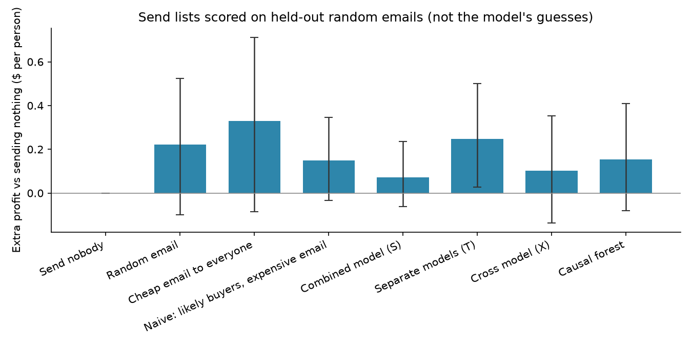

# Causal Uplift + Budget Allocation

A company can send each customer a **men’s-product email** ($0.50), a **women’s-product email** ($0.20), or nothing. There is not enough money to give everyone the expensive one. This project:

1. Estimates **who actually spends more because of which email** (not who was going to buy anyway).
2. Spends a **fixed budget** where each dollar of send cost is expected to cause the most leftover profit.
3. Grades every send list with **held-out random emails and real spending**, not the model’s own guesses.

Public data: Kevin Hillstrom’s MineThatData email experiment (~64k customers, random 1/3 assignment). Economics are imposed in code (`$0.20` / `$0.50` send costs; budget = 15% of “men’s email to everyone,” **$2,400** on a 32k holdout). Choices and grading method: [METHODS.md](METHODS.md).

---

## The money chart

Extra profit **per person vs sending nobody**, averaged over the whole 32k holdout (including people we do not email). Bars are the honest score; whiskers are a 95% range. Almost everyone spends $0, so the ranges are wide.



“Cheap email to everyone” and “random email” are **not** under the $2,400 cap. They are reference plans. Everything labeled naive or “model” spends essentially the full **$2,400**.

---

## Iteration log

**Naive plan.** Ignore which email was sent. Predict who is likely to spend anyway. Blast the expensive men’s email at those people until the budget runs out: **4,800** contacts, **$0.15** extra profit per person. The range **includes $0**. Roughly break-even: paying to email people who were going to buy anyway.

**Effect-based plans.** Fit models on the other half of the data that estimate extra dollars from each email vs nothing. Rank person–email pairs by leftover profit per dollar of send cost. Skip emails whose leftover is zero or negative. Each person gets at most one email.

| Plan | Women’s | Men’s | Left alone | Extra profit / person | 95% range |
|---|---:|---:|---:|---:|---|
| Send nobody | 0 | 0 | 32,000 | $0.00 | — |
| Naive | 0 | 4,800 | 27,200 | $0.15 | −$0.03 to $0.35 |
| Combined model (S) | 2,140 | 3,944 | 25,916 | $0.07 | includes $0 |
| Separate models (T) | 5,972 | 2,411 | 23,617 | $0.25 | $0.03 to $0.50 |
| Cross model (X) | 5,890 | 2,444 | 23,666 | $0.10 | includes $0 |
| Causal forest | 2,697 | 3,721 | 25,582 | $0.15 | includes $0 |

**What the honest grade said.** The T-learner mix is the only budgeted plan whose range sits entirely above zero on this split. It is about **25 cents** above nobody, versus **15 cents** for naive — only about **10 cents** above the dumb plan, and the ranges overlap. S, X, and the forest look like naive once you stop trusting the models’ own scores. Do not crown a winner.

The T-learner edge is mostly **using the cheap email**: ~8,400 contacts for the same $2,400, versus 4,800 expensive emails. Targeting cannot invent a bigger effect than the experiment has (men’s email is only about 60–80 cents extra spend before the 50-cent cost).

Exact numbers: [results/metrics.json](results/metrics.json).

---

## Money

On the 32k holdout, 25 cents per person is about **$8,000** extra profit after paying for emails; naive is about **$4,700**. Same **$2,400** budget. That is leftover sales, not a multiple of spend. Half the budget ($1,200) drops the T-learner score to about **3 cents** a person, and the range includes $0 — there is not a large, stable pie to slice.

---

## Who gets which email

Under the T-learner list:

- **Left alone (~23.6k):** typical last-year spend (~$223), about half already bought women’s items. We skip them because the budget ran out, not because email would hurt them. People we skipped who still got a random email in the old experiment visited *more*, not less.
- **Women’s email (~6.0k):** more last-year women’s-item buyers (~66%). That matches the raw experiment: the cheap email mainly moves that group.
- **Men’s email (~2.4k):** higher last-year spend (~$398) and more recent buyers. The expensive email is the one that works for almost everyone; the budget only stretches to the people where leftover profit per dollar looks highest.

No “do not contact, it will annoy them” group shows up in this store file.

---

## Running this regularly

Score a fresh list with models trained on the last randomized send. Rebuild when the mix of responders drifts (season, creative, list source) or when a new experiment is cheaper than trusting old extras. Watch the honest score on a held-out slice of each campaign, not the model’s predicted extra. If you cannot randomize a slice, you cannot grade the plan the way this repo does.

---

## Setup (Python 3.11)

```powershell
py -3.11 -m venv .venv
.\.venv\Scripts\Activate.ps1
python -m pip install --upgrade pip
pip install -r requirements.txt
pip install -e .
python run_all.py
```

The CSV is already in `data/raw/hillstrom.csv` (offline). `run_all.py` rebuilds the figures, `results/metrics.json`, and runs tests. It does **not** generate made-up customers.

Notebooks: `notebooks/01_look_at_the_data.ipynb`, `02_effects_and_plan.ipynb`, `03_honest_grading.ipynb`. `04_made_up_dataset.ipynb` is a code check on fake customers with a known answer, not a store result.
